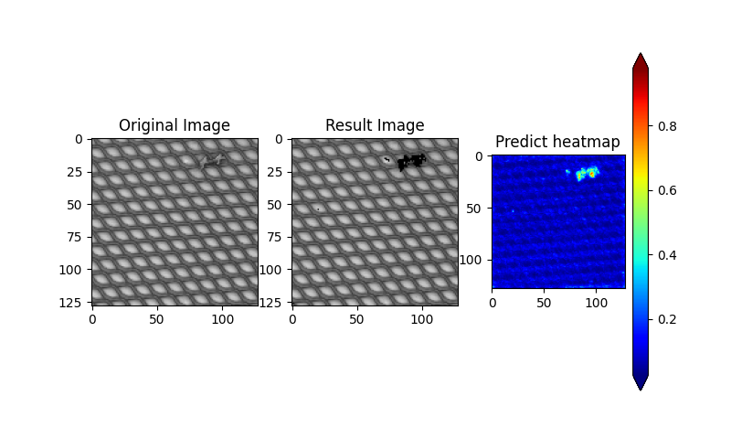
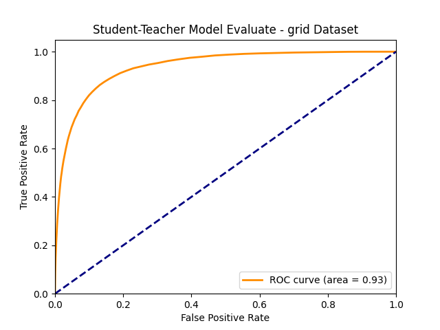

# student-teacher-abnormaly-detection
Implement Teacher-Student network for abnormaly detection.

## How to use

* Download dataset from [MVTec dataset](https://www.mvtec.com/company/research/datasets/mvtec-ad/)

* Run the predict.py script.
```
cd src
python3 demo.py -img {path to image} -model {path to model}
```

## Result
### Image

### Accuracy
For dataset 'grid' (https://www.mvtec.com/company/research/datasets/mvtec-ad/)


## Working folder structure
├── data   
│   ├── grid  
│   └── cable  
├── resnet18  
│   ├── student_resnet18.pth    
│   └── teacher_resnet18.pth
├── trained-model   
│   ├── model_0_grid.pth  
│   └── model_1_grid.pth    
├── README.md  
├── result  
│   ├── grid_bent.png  
│   └── grid_broken.png   
├── src  
    ├── config.py  
    ├── demo.py  
    ├── evaluate.py  
    ├── model.py  
    ├── process_data.py   
    ├── train.py  
    └── utils.py  

## References

### Dataset