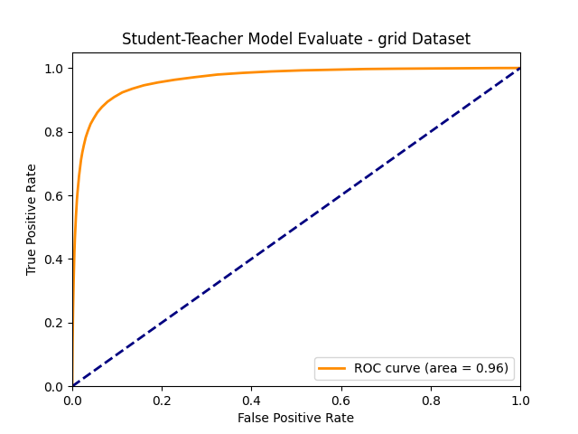

# student-teacher-abnormaly-detection
Implement Teacher-Student network for abnormaly detection. We used simple model architect (resnet18) for high accuracy.

## How to use

* Download dataset from [MVTec dataset](https://www.mvtec.com/company/research/datasets/mvtec-ad/)

* To detect abnormal region on a image run the predict.py script.
```
cd src
python3 demo.py -i {path to image} -m {path to model}
```

* To train student neural network with your dataset.

Make sure that your dataset directory has the same structure as:    
└── data   
    ├── grid    
    │   ├── ground_truth    
    │   │   ├── {type of defect 1}    
    │   │   │   ├── 000_mask.png    
    │   │   │   └── 001_mask.png    
    │   │   └── {type of defect 2}  
    │   │       ├── 000_mask.png    
    │   │       └── 001_mask.png    
    │   ├── test   
    │   │   ├── {type of defect 1}  
    │   │   │   ├── 000.png    
    │   │   │   └── 001.png 
    │   │   ├── {type of defect 2}  
    │   │   │   ├── 000.png 
    │   │   │   └── 001.png  
    │   │   └── good    
    │   │       ├── 000.png   
    │   │       └── 001.png    
    │   └── train    
    │       └── good    
    │           ├── 000.png 
    │           └── 001.png 
    └── carpet
```
cd src
python3 train.py -d {name of dataset} -n {number of student network} -e {number of epoch}
```

## Result
### Image

### Accuracy
For dataset 'grid' (https://www.mvtec.com/company/research/datasets/mvtec-ad/)


## Working folder structure
├── data   
│   ├── grid    
│   └── carpet  
├── resnet18  
│   ├── student_resnet18.pth    
│   └── teacher_resnet18.pth    
├── trained-model   
├── README.md 
├── requirements.txt 
├── result       
└── src  
    ├── config.py  
    ├── demo.py  
    ├── evaluate.py  
    ├── model.py  
    ├── process_data.py   
    ├── train.py  
    └── utils.py  

## References

### Dataset